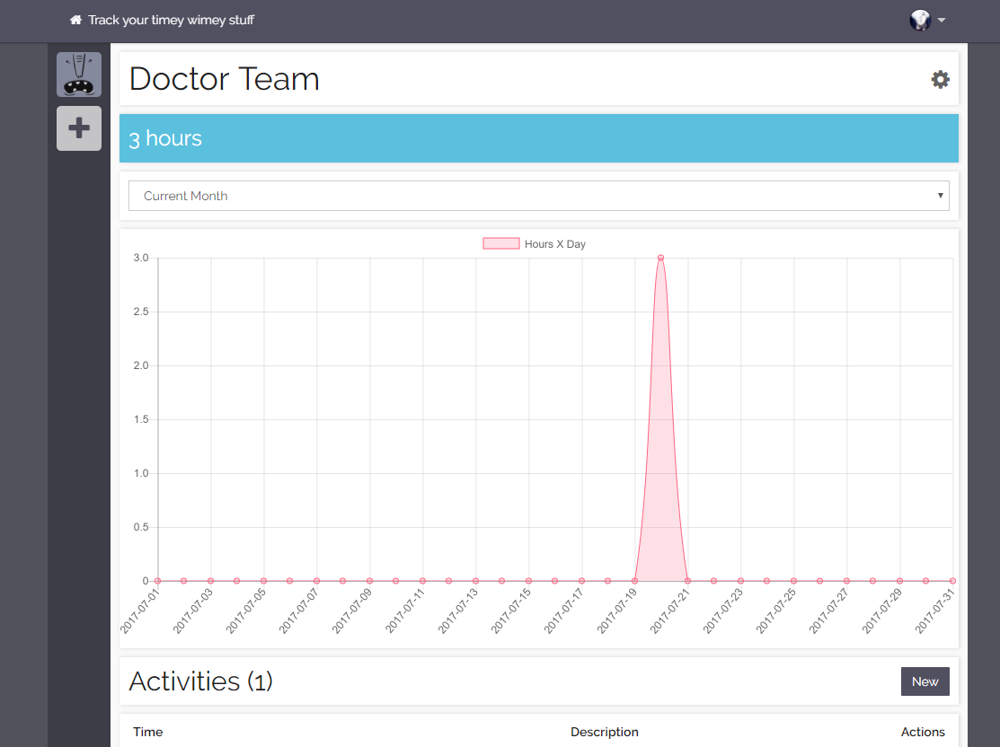

# Installation

1) Clone repository
```
git clone https://github.com/EchoWine/Gate [directory]
cd [directory]
```

2) Install with composer
```
composer install
```

3) Copy env files and setup environment 

For env.js you will need an OAuth application in both github/gitlab
```
cp .env.example .env
cp src/Nut/env.js.example src/Nut/env.js
```

4) Setup laravel
```
php artisan key:generate
php artisan migrate
php artisan storage:link

```

5) Run 
```
npm install
npm run development
```
